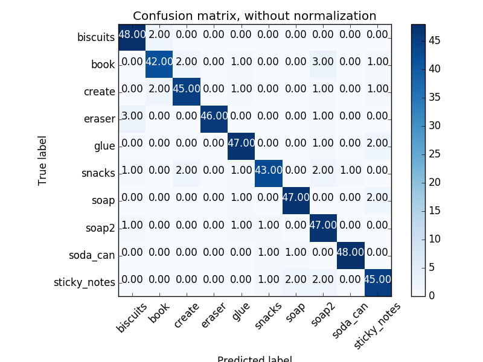
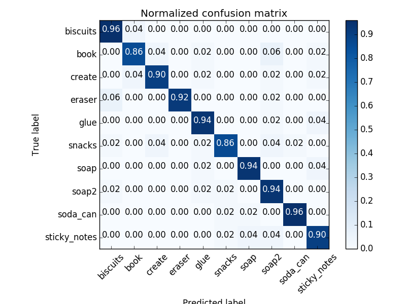

## Project: Perception Pick & Place

## 1. RANSAC filtering

Sample code for RANSAC filtering

```python
def voxel_downsampling(cloud):
    # Voxel grid downsampling of input cloud
    voxels = cloud.make_voxel_grid_filter()
    LEAF_SIZE = 0.005
    voxels.set_leaf_size(LEAF_SIZE, LEAF_SIZE, LEAF_SIZE)
    out_cloud = voxels.filter()
    print("Voxel grid downsampling {}".format(out_cloud.size))
    return out_cloud

```

## 2. Pipeline for clustering for segmentation

For Euclidean clustering

```python

def euclidean_clustering(cloud):
    print("Euclidean clustering")
    white_cloud = XYZRGB_to_XYZ(cloud)
    tree = white_cloud.make_kdtree()

    ec = white_cloud.make_EuclideanClusterExtraction()
    ec.set_ClusterTolerance(0.01)
    ec.set_MinClusterSize(20)
    ec.set_MaxClusterSize(2000)

    ec.set_SearchMethod(tree)
    cluster_indices = ec.Extract()
```

A passthrough filter on both z and y axis with parameters as follows

```python

def pass_through_filter(cloud):
    # filter through z axis first
    print("running pass through filter")
    pass_through = cloud.make_passthrough_filter()
    filter_axis = 'z'
    axis_min = 0.6
    axis_max = 1.
    pass_through.set_filter_field_name(filter_axis)
    pass_through.set_filter_limits(axis_min, axis_max)
    out_cloud = pass_through.filter()
    
    # filter through y axis
    pass_through = out_cloud.make_passthrough_filter()
    filter_axis = 'y'
    axis_min = -0.5
    axis_max = 0.5
    pass_through.set_filter_field_name(filter_axis)
    pass_through.set_filter_limits(axis_min, axis_max)
    out_cloud = pass_through.filter()
    return out_cloud
```

## 3. Feature extraction and training SVM and use it for object recognition

```python
# Compute the associated feature vector
chists = compute_color_histograms(ros_cluster, using_hsv=True)
normals = get_normals(ros_cluster)
nhists = compute_normal_histograms(normals)
feature = np.concatenate((chists, nhists))

# Make the prediction, retrieve the label for the result
# and add it to detected_objects_labels list
prediction = clf.predict(scaler.transform(feature.reshape(1,-1)))
label = encoder.inverse_transform(prediction)[0]
```

## 4. Computing histograms

The normal histogram is computed similar as follow.
```python 
def compute_color_histograms(cloud, using_hsv=True):

    # Compute histograms for the clusters
    point_colors_list = []

    # Step through each point in the point cloud
    for point in pc2.read_points(cloud, skip_nans=True):
        rgb_list = float_to_rgb(point[3])
        if using_hsv:
            point_colors_list.append(rgb_to_hsv(rgb_list) * 255)
        else:
            point_colors_list.append(rgb_list)

    # Populate lists with color values
    channel_1_vals = []
    channel_2_vals = []
    channel_3_vals = []

    for color in point_colors_list:
        channel_1_vals.append(color[0])
        channel_2_vals.append(color[1])
        channel_3_vals.append(color[2])
    
    # TODO: Compute histograms

    # TODO: Concatenate and normalize the histograms

    # Generate random features for demo mode.  
    # Replace normed_features with your feature vector
    channel_1_hist = np.histogram(channel_1_vals, bins=32, range=(0, 256))
    channel_2_hist = np.histogram(channel_2_vals, bins=32, range=(0, 256))
    channel_3_hist = np.histogram(channel_3_vals, bins=32, range=(0, 256))

    '''
    Concatenate and normalize the histograms
    '''
    hist_features = np.concatenate((channel_1_hist[0], channel_2_hist[0], channel_3_hist[0])).astype(np.float64)
    # Generate random features for demo mode.
    # Replace normed_features with your feature vector
    normed_features = hist_features / np.sum(hist_features)
    return normed_features
```

## 5. Cofusion matrix for SVM

Confusion matrix that we get by using **500** poses for each of the objects used in `pick_list_*.yaml` files.


Normalized confusion is 

